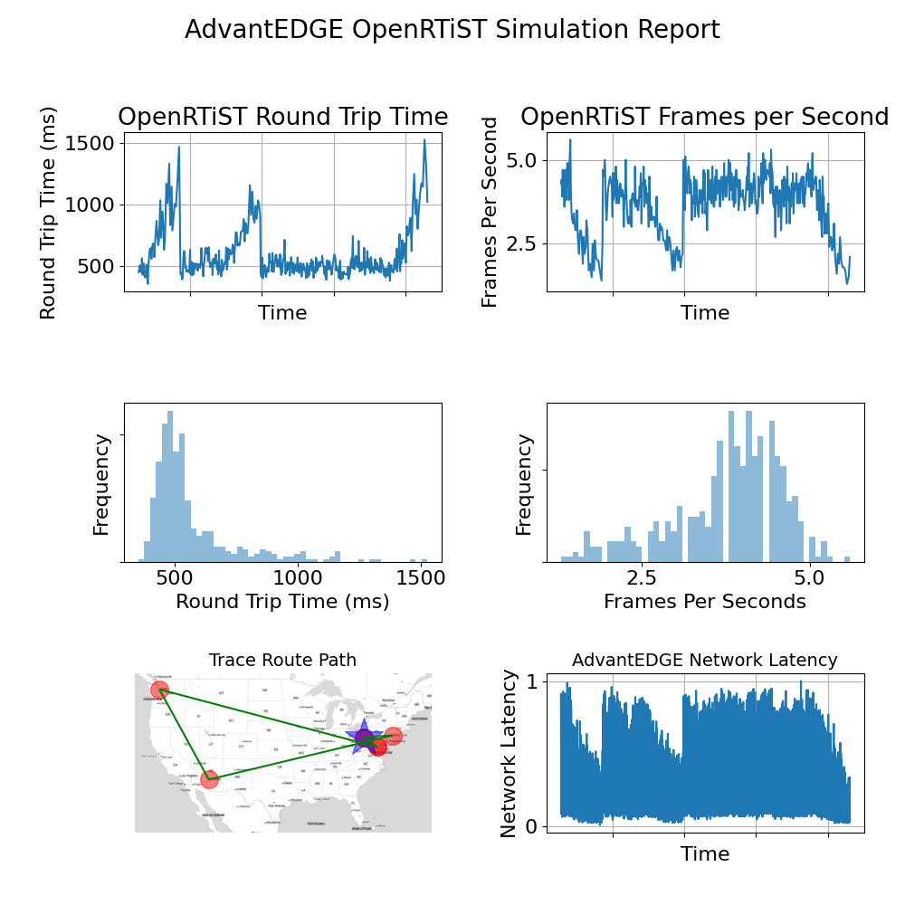

# PyEdgeSim

## Introduction

PyEdgeSim is a *mostly* python-based simulation framework built around the [AdvantEDGE Mobile Edge Emulation Platform](https://github.com/InterDigitalInc/AdvantEDGE). This framework was used to run the simulations covered in the Carnegie Mellon University Computer Science Department Technical Report, [*Simulating Edge Computing Environments to Optimize Application Experience*](http://reports-archive.adm.cs.cmu.edu/anon/2020/CMU-CS-20-135.pdf) and the Open Edge Computing Initiative whitepaper *[How Close to the Edge?: Edge Computing and Carrier Interexchange](https://bit.ly/3ruDEYQ)*. These simulations evaluated the performance of an edge-native application, [OpenRTiST](https://ieeexplore.ieee.org/document/9229154), while emulating mobile edge networks in a variety of conditions using the AdvantEDGE platform.

PyEdgeSim is structured as an exercise to set up the simulation environment, run a *Hello World* simulation, view the simulation with a Grafana dashboard and produce a simple report from the captured data. Once you complete the exercise, we expect that you will customize the application, the AdvantEDGE scenario, the simulation script, the dashboard and the final report for your own purposes. You can view this exercise as a *quickstart* to accelerate the learning curve in using AdvantEDGE as an emulation tool.

Detailed instructions are below but the basic process is:

1. Procure a client and server to run the environment.

2. Install and configure the prerequisites.

3. Install and deploy the PyEdgeSim building blocks.
   * Install kubernetes and helm and start a kubernetes cluster
   * Install the AdvantEDGE build tools; Build and deploy AdvantEDGE.
   * Get the OpenRTiST client and server.
   * Set up the simulation scenario.
   * Set up the data management engine and visualization tools (InfluxDB and Grafana).
   * Set up the automation engine
   
4. Connect your OpenRTiST client to the server.

5. Run a test automation.

6. Generate a test report.

------
## PyEdgeSim Platform


------

## Prerequisites

To execute this exercise, you will need:

- A Linux Server -- either a virtual machine or a bare metal. This server will also need an IP address that the client can reach.
- An Android Client with permission and capability to download and install apks.

The exercise was tested and developed using the following system configurations. It is recommended to follow these configurations as closely as possible. It is highly recommended that you use Ubuntu 18.04 for the server and a modern Android device for the client.

### Server Configuration

- Ubuntu 18.04 or 20.04 
- At least 128 GB of storage
- Python 3.6
- Docker version 1.19
- XFCE desktop via TightVNC
- Chrome Browser
- AdvantEDGE 1.7.1 and 1.8.0

### Client Configuration

- Samsung Galaxy S8 with Android 9
- Essential PH-1 with Android 10

#### GPU Implementation
While a GPU is not required, PyEdgeSim's OpenRTiST application will run faster with one. Using an NVIDIA GPU requires three things:
1. Equipping your server with a GPU and install the corresponding host driver.

2. Configuring docker to use a GPU by installing and configuring nvidia-docker2 and updating /etc/docker/daemon.json

Your `/etc/docker/daemon.json` file should look something like this. Don't forget to restart docker with `sudo systemctl restart docker`

	{
	  "default-runtime": "nvidia",
	  "runtimes": {
	        "nvidia": {
	            "path": "nvidia-container-runtime",
	            "runtimeArgs": []
	        }
	  },
	  "exec-opts": ["native.cgroupdriver=systemd"],
	  "log-driver": "json-file",
	  "log-opts": {
	    "max-size": "100m"
	  },
	  "storage-driver": "overlay2"
	}


3. Configuring kubernetes to use a GPU. You will be prompted to do this after installing kubernetes in step 1 of the exercise below.

Only the OpenRTiST pod will use the GPU in this exercise.

#### Low-latency Networking
The application will also perform better if your environment has low-latency networking between the client and the server. This is difficult to measure in practice but connecting the client and server to the same LAN subnet will usually give the best performance. Wired connections will perform better than wireless.

## Exercise 1: Configure the Platform

### Server Setup

Install docker and configure yourself as a docker user. Then, reboot.

Open firewall ports 80 (HTTP), 443 (HTTPS), 22 (SSH), 30086 (InfluxDB) and 31001 (OpenRTiST).

Clone the repository and install the required packages:

> git clone https://github.com/jblakley/PyEdgeSim
> 
> \# Optionally checkout a specfic branch
> 
> git checkout 1.8.0
> 
> cd PyEdgeSim
>
> python install_requirements.py

When prompted to <u>select the Linuxbrew installation directory</u>, enter ^D then return.

When prompted to set up automation, select "y". You will run this again during the main exercise.

PyEdgeSim configuration details are in `config.json`. You won't need to play with most of these but set the project directory, `PROJECTHOME` to your preferred (usually `$HOME`).

Now, its time to set up the simulation. Execute:

`./simulation_setup.py`

This script will walk you through several steps. Each step is as automated as possible so user interaction is minimized. If any step fails, you can usually restart from that point forward by skipping the steps you have already completed. The steps are:

1. Set up the AdvantEDGE runtime environment. This step installs and configures Kubernetes, Helm and AdvantEDGE. It is an automation of directions [here](https://github.com/InterDigitalInc/AdvantEDGE/wiki/env-runtime).
2. Set up the AdvantEDGE build environment. This step installs and configures go, nodejs with nvm & npm,  ESLint, GolangCI-Lint, meepctl and the meep microservices. It is an automation of the directions [here](https://github.com/InterDigitalInc/AdvantEDGE/wiki/env-dev) and [here](https://github.com/InterDigitalInc/AdvantEDGE/wiki/mgmt-workflow).
3. Deploy AdvantEDGE. This step deploys the meep dependencies services then dockerizes and deploys the meep core services.  It is an automation of the directions [here](https://github.com/InterDigitalInc/AdvantEDGE/wiki/mgmt-workflow).

At this point, AdvantEDGE should be running. You can check this by running `k9s` or opening a browser window to `127.0.0.1`. If you start a new bash shell, your `.bashrc` should be configured for `kubectl`, `meepctl`, `go`, `npm` and `nvm`. To verify, run:

```
kubectl version; meepctl version; go version; npm version; node -v;  nvm --version
```

The script now continues to:

4. Download the docker image for the `OpenRTiST` server and push it into the local repository.
5. Copy the simulation scenario charts into AdvantEDGE.

At this point, before deploying the scenario, some manual effort is required outside of the script.

6. Open a browser window to `localhost`or the server's public IP to connect to the AdvantEDGE console.
7. Select the *CONFIGURE* tab and  import `adv-ortist-sim.yaml` from the PyEdgeSim `data/scenarios` directory. Save the scenario with the name `adv-ortist-sim`.
8. Select the *EXECUTE* tab and create a new sandbox named `adv-ortist-sim`. Wait for the sandbox to be created (*watch the red stoplight turn green*). Now,  deploy the `adv-ortist-sim` scenario. If this is successful, you will see two network elements, `openrtist-client1` and `openrtist-svc1` at the bottom of the *EXECUTE* page. You will also see these two pods when running a `kubectl get pods` command or by looking in `k9s`.

You can now continue the `simulation_setup.py` script.

9. Stop and restart the scenario. This also tests that the automation tools are working properly.
10. Set up the data management elements, influxdb and grafana. 
    - To expose influxdb outside of the server cluster, this step stops the `adv-ortist-sim` scenario, deletes the sandbox and restarts AdvantEDGE. The process will take some time. You can validate that it worked by going to another machine with influxdb installed and running `influx -port 30086 -host <PUBLICIP-OF-SERVER>`. If it can't connect, make sure you opened port 30086 on your server.
    - From the browser, recreate your `adv-ortist-sim` sandbox and redeploy the `adv-ortist-sim` scenario.
    - From the script, setup grafana. 
    - Then, open a browser tab to `http://localhost/grafana`, login at lower left with username = admin and pw = admin. Use the `+` to import the `Client Framerate and Round Trip Time.json` dashboard from the PyEdgeSim `data/grafana` directory. 
    - The map in the dashboard is locked to the the Pittsburgh east end. You can change this by editing that panel and changing the GPS coordinates.
11. The script will prompt you to setup automation. You already did this during the requirements installation but no harm in doing it again to be safe.
12. Run the test automation. You can view the progress from the grafana dashboard. You'll see a network latency step graph in the lower left. Since you have not yet configured the client, you won't see anything meaningful in the upper half of the dashboard. 

The final step in the script is the generation of a test report. We'll come back to this after the client is configured. You've completed the server configuration. For now, you can exit from the `simulation_setup.py` script.

### Client Setup

1. On your android client device, download and install the instrumented OpenRTiST client from [here](http://visualcloudsystems.org/cmudl/app-measurementDB-debug.apk).
2. When the OpenRTiST client opens, approve permission requests as prompted. These enable the client to collect measurements from the device. 
3. On the OpenRTiST client Server List, create a new server using an address of `<YOUR-SERVER-PUBLIC-IP>:31001`. Open that server and approve any other requested permissions. You should now be connected to the OpenRTiST server and can display the artistic style of your choice from the drop down. If you can't connect, check that port 31001 is open on your server.


## Exercise 2: Running the Simulation

With both the client and server running, connected and displaying style transfer, rerun the test automation by skipping through the prior steps in `simulation_setup.py`. 

When you get a complete run with both the lower and upper dashboard showing data, create the test report to see that everything is working. The report is written to a file called `report.png`. It should look something like this. You will also find the data behind the report as csv files in the `output` folder.



You have now completed the exercise.
